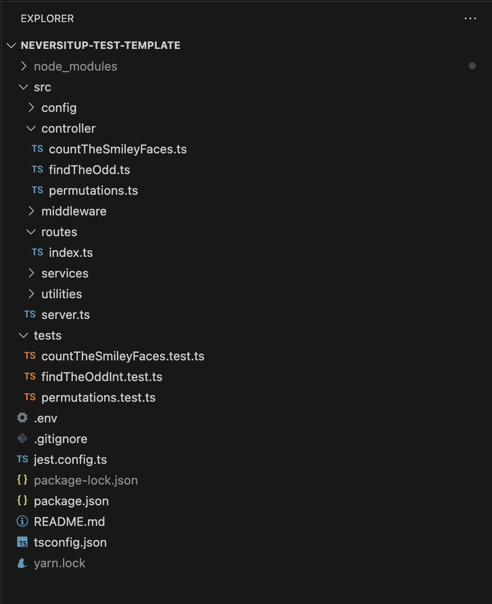

# neversitup-test-template

    Thank you for this opportunity.

# Setup

1. `npm install` – install dependencies
2. `npm test` – run all tests once

# structure

1. server.ts
   เริ่มต้นด้วยการ setup การเชื่อมต่อต่างๆ ในไฟล์นี้ ไม่ว่าจะเป็น
   - sever
   - config database
   - main route ต่างๆ
     etc.
2. routes
   โฟลเดอร์นี้จะรวบรวมและจัดการ route ที่จะวิ่งเข้ามายัง controller และ วิ่งออกไปจาก controller
   โดยจะจัดแบ่งแยกย่อยตาม group ออกไปอีกก็ได้ตาม scal ของ product นั้นๆ
   .
3. middleware
   โฟลเดอร์นี้จะรวบรวม เงื่อนไขตรวจสอบสิทธิ์การเข้าใช้งาน เหมือนป้อมด่านแรก ไม่ว่าจะเป็นการเช็ค header token หรือ key ต่างๆตามที่เราเลือกใช้
   .
4. controllers
   เป็นโฟลเดอร์ที่จัดการ การทำงานของระบบทั้งหมด ให้เป็นสัดส่วน ง่ายต่อการจัดการและ implement ภายหลัง
   .
5. utilities
   จะเป็นโฟลเดอร์ที่เก็บรวบรวม common component ต่างๆ ที่สามารถใช้ร่วมกันได้ หรือ เป็นตัวกลางการทำงานได้ เช่น
   request-handler กลาง จัดการ respon ให้โครงสร้างเหมือนกันทั้งระบบ เพื่อง่ายต่อการใช้งานต่อ
   .
6. config
   โฟลเดอร์นี้จะรวบ config ต่างๆที่ใช้ในระบบ หรือ เชื่อมต่อกับ third party ต่างๆเช่น config email payment gateway และอื่นๆ เป็นต้น
   .
7. service
   ไฟล์นี้รวบรวมการทำงานที่ถูกเรียกใช้จากหลายๆ ที่ในระบบ กรณีต้องการใช้ service functions นี้ซ้ำๆ บ่อยๆ

Remark: โครงสร้างนี้ สามารถปรับเปลี่ยนไปตามงานที่ได้รับ หรือ ตาม scal ของตัวงาน
